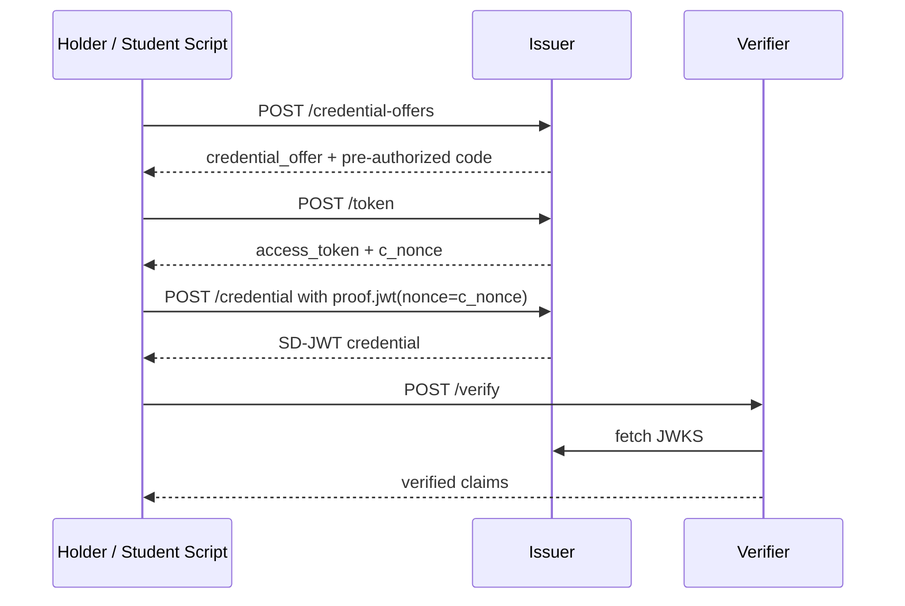

# Lab 01 — SD-JWT Issuance (OIDC4VCI)

Lab ID: `01` · Timebox: 20 minutes

Goal: implement offer → token → credential for SD-JWT VCs so the verifier can see issued claims.

## What This Lab Is Doing

This lab introduces the first real credential lifecycle. Students are building the issuer-side OIDC4VCI flow for pre-authorized issuance and the verifier-side SD-JWT validation flow.

Conceptually, three things happen:

1. the issuer creates an offer and a one-time pre-authorized code
2. the holder exchanges that code for an access token and `c_nonce`
3. the holder proves possession of the `c_nonce`, receives an SD-JWT credential, and sends it to the verifier

The `c_nonce` matters because it binds the issuance request to a fresh proof and prevents replay of stale requests.

## Flow Overview



## What Students Should Understand

- issuance is a multi-step protocol, not a single POST
- the token endpoint and credential endpoint have different jobs
- SD-JWT lets the issuer sign claims while the verifier later checks disclosed values against hashes
- the verifier is validating both issuer signature material and disclosure integrity

Environment tracks
- Codespaces
  - Stay on `main` in your Codespace.
  - Your `.env` files and dependencies should already be ready from setup.
- Local terminal
  - Stay on `main` in your local clone.
  - If you are starting fresh, run `pnpm env:setup` and `pnpm install -r --frozen-lockfile`.

Steps (edit + test)
1) Implement issuer offer and token
   - Open `issuer/src/index.ts`, section `// --- Offers, tokens, credentials ---`.
   - `/credential-offers`: accept `{credentials: ["AgeCredential"]}`, create a pre-authorized code (UUID), store with expiry (10 min), respond with `credential_offer` containing `credential_configuration_ids` and the code.
   - `/token`: accept `grant_type = urn:ietf:params:oauth:grant-type:pre-authorized_code`, look up the code, issue `access_token` (UUID) + `c_nonce` (UUID) with expiry (10 min / 5 min), delete the one-time code. If DPoP is off, skip JKT checks.
2) Implement SD-JWT issuance
   - In `/credential`, require `Authorization: Bearer <access_token>`, validate expiry, ensure token is authorized for the requested credential id/format.
   - Enforce c_nonce: decode `proof.jwt` and require `nonce === c_nonce` and `aud` matches issuer.
   - Issue SD-JWT: create disclosures per claim (salt + claim name + value), hash them into the payload per SD-JWT spec, sign with ES256 (`SignJWT` + issuer keypair), return `sd_jwt`, `disclosures`, and combined `credential` (`sd_jwt~disclosure~...`).
   - Store issued credential metadata in memory for debugging (`issued` map).
3) Verifier SD-JWT verification
   - Open `verifier/src/index.ts`, implement `verifySdJwtPresentation` (or the branch handling `vc+sd-jwt`): fetch issuer JWKS, verify signature, recompute disclosure hashes, and confirm claims.
   - `/debug/credential` should return the last verified payload.
4) Run and test
   - Start services: `pnpm dev`.
   - Issue offer: `curl -s -X POST http://localhost:3001/credential-offers -H 'content-type: application/json' -d '{"credentials":["AgeCredential"]}' | jq`.
   - Exchange token: `curl -s -X POST http://localhost:3001/token -H 'content-type: application/json' -d '{"grant_type":"urn:ietf:params:oauth:grant-type:pre-authorized_code","pre-authorized_code":"<code_from_offer>"}' | jq`.
   - Prepare a simple unsigned proof JWT (alg `none`) that carries the `c_nonce`:
     ```bash
     PROOF_JWT=$(node -e "const h=Buffer.from('{\"alg\":\"none\"}').toString('base64url');const p=Buffer.from(JSON.stringify({nonce:'<c_nonce>',aud:'http://localhost:3001/credential'})).toString('base64url');console.log(`${h}.${p}.`)")
     ```
     Replace `<c_nonce>` with the value from `/token`.
   - Get credential: `curl -s -X POST http://localhost:3001/credential -H "authorization: Bearer <access_token>" -H 'content-type: application/json' -d "{\"format\":\"vc+sd-jwt\",\"claims\":{\"age_over\":21,\"residency\":\"SE\"},\"proof\":{\"proof_type\":\"jwt\",\"jwt\":\"${PROOF_JWT}\"}}" | jq`.
   - Verify: `curl -s -X POST http://localhost:3002/verify -H 'content-type: application/json' -d '{"format":"vc+sd-jwt","credential":"<sd_jwt~disclosures>"}' | jq`.
   - Check debug: `curl -s http://localhost:3002/debug/credential | jq`.

Pass criteria
- `/verify` returns `ok: true` with the expected claims.
- `/debug/credential` shows the verified credential payload.
- Token and c_nonce expire as configured (retrying with an old token should fail).

Troubleshooting
- `invalid_grant`: ensure the pre-authorized code from `/credential-offers` is used once and within 10 minutes.
- `invalid_proof` (c_nonce mismatch): confirm the `proof.jwt` nonce matches the latest `c_nonce` returned by `/token`.
- Signature errors: make sure JWKS URL matches the issuer base URL in the verifier env. 
