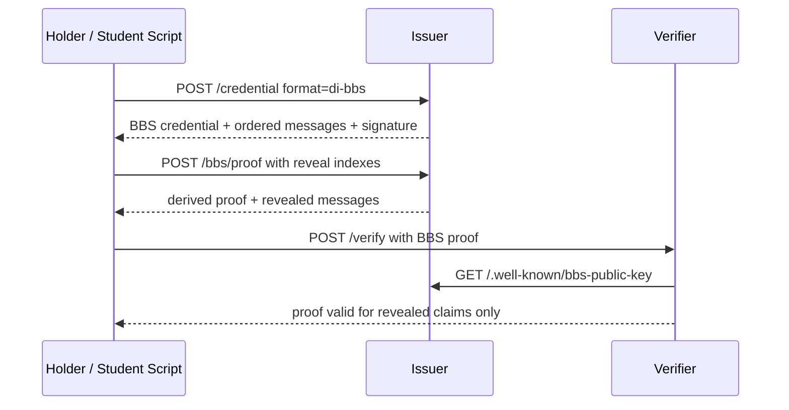

# Lab 02 — BBS+ Selective Disclosure

Branch: `lab-02-bbs` · Timebox: 25 minutes

Goal: issue DI+BBS credentials and verify unlinkable proofs revealing only selected claims.

## What This Lab Is Doing

This lab shifts from plain issuance to privacy-preserving presentation. The issuer still signs a credential, but the holder does not send the whole thing to the verifier. Instead, the holder derives a new BBS+ proof that reveals only the claims requested for the relying party.

The mental model for students should be:

1. issuer signs a fixed ordered list of messages
2. holder chooses which message indexes to reveal
3. holder derives a proof that is valid for those revealed messages only
4. verifier checks the proof without learning the hidden messages

That fixed message order is crucial. If the holder and verifier disagree on message ordering, proof verification fails.

## Flow Overview

## What Students Should Understand

- BBS+ is about selective disclosure, not just another signature format
- the full credential and the presentation proof are different artifacts
- nonce changes make proofs unlinkable across presentations
- reveal indexes and message order are part of the cryptographic contract

Prereqs
- Checkout branch: `git checkout lab-02-bbs`.
- Env ready: `pnpm env:setup`.
- Services running: `pnpm dev`.

Steps (edit + test)
1) Add BBS credential config
   - In `issuer/src/index.ts`, extend `credentialsSupported` with `AgeCredentialBBS` (`format: "di-bbs"`, scope `age_bbs`).
2) Issue BBS credential
   - In `/credential` handler, branch on `di-bbs`: use `generateBbsKeypair` (already initialized) and `signMessages` from `bbs-lib`.
   - Messages order (example): `[subject, age_over, residency, statusListEntry]`. Keep the order fixed for reveal indices.
   - Return `credentialId`, `format: "di-bbs"`, `credentialStatus` (status list entry), `signature` (base64), `messages` (string array), `nonce`, `publicKey` (base64), and `revealIndexes` map.
   - Keep `DEMO_MODE` note to point to `/bbs/proof`.
3) Demo proof helper
   - Implement `/bbs/proof` (or enable if stubbed): accept `signature`, `messages`, `reveal` (default `[1]`), `nonce` (default `bbs-demo-nonce`); call `deriveProof` from `bbs-lib`; return `proof` (base64), `revealedMessages`, `nonce`, `publicKey`.
4) Verifier BBS flow
   - In `verifier/src/index.ts`, implement the BBS branch (or `verifyBbsPresentation`): fetch issuer BBS public key from `.well-known/bbs-public-key`, decode base64, and call `verifyProof` from `bbs-lib` with `revealedMessages` and `nonce`.
   - Accept `credentialStatus` payload and stash it for the next lab (revocation not yet enforced).
5) Run and test
   - Get BBS credential: `curl -s -X POST http://localhost:3001/credential -H "authorization: Bearer <access_token>" -H 'content-type: application/json' -d '{"format":"di-bbs","claims":{"age_over":25,"residency":"SE"},"proof":{"proof_type":"jwt","jwt":"{\"nonce\":\"<c_nonce>\"}"}}' | jq`.
   - Derive proof (demo helper): `curl -s -X POST http://localhost:3001/bbs/proof -H 'content-type: application/json' -d '{"signature":"<signature>","messages":<messages_array>,"reveal":[1],"nonce":"bbs-demo-nonce"}' | jq`.
   - Verify proof: `curl -s -X POST http://localhost:3002/verify -H 'content-type: application/json' -d '{"format":"di-bbs","proof":{"proof":"<proof>","revealedMessages":["age_over:25"],"nonce":"bbs-demo-nonce"}}' | jq`.
   - Check debug: `curl -s http://localhost:3002/debug/credential | jq`.

Pass criteria
- `/verify` returns `ok: true` for BBS proofs revealing only `age_over`.
- Re-running `deriveProof` with a different nonce yields a different proof (unlinkable).

Troubleshooting
- `bbs_proof_failed`: ensure `messages` array matches the original order used during signing.
- Verification fails after changing `reveal`: regenerate the proof with the new indices; proof and reveal indices must match.
- If the verifier cannot fetch the BBS key, confirm `BBS_KEY_URL` env points to the issuer. 
