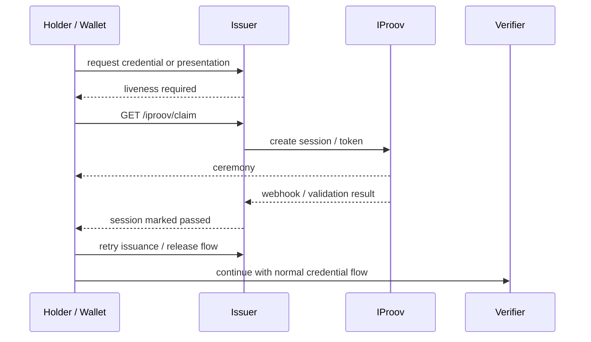

# Lab 04 — iProov Liveness Gate

Lab ID: `04` · Timebox: 20 minutes

Goal: require a successful iProov verification before releasing/presenting credentials.

## What This Lab Is Doing

This lab adds a liveness gate to the credential flow. Up to this point, the system checks whether a credential is structurally valid. In this lab, students add a policy decision: do not issue or release the credential flow until the subject has passed an iProov ceremony.

There are two moving parts:

1. a claim/session endpoint that starts the iProov ceremony
2. a webhook or validation result that marks the session as passed

Only after both exist can the issuer or wallet enforce the gate.

## Flow Overview



## What Students Should Understand

- iProov is a gate in front of the VC flow, not a replacement for the VC flow
- session state must be persisted somewhere so later requests can see the pass result
- the ceremony step and the policy decision step are separate
- demo mode and real mode can share the same control flow even if the underlying ceremony differs

Environment tracks
- Codespaces
  - Stay on `main` in your Codespace.
  - Your `.env` files and dependencies should already be ready from setup.
- Local terminal
  - Stay on `main` in your local clone.
  - If you are starting fresh, run `pnpm env:setup` and `pnpm install -r --frozen-lockfile`.

Additional setup
- iProov sandbox credentials available (use placeholders if demoing).
- This workshop uses a Codespaces-only setup for the real iProov flow.
- In Codespaces, the instructor has already provided the required iProov credentials.
- Students should not edit `issuer/.env` or paste iProov secrets into the repo.
- Outside Codespaces, use the demo webhook path unless the instructor has explicitly provided a separate local setup.

Steps (edit + test)
1) Add claim + webhook endpoints
   - In `issuer/src/index.ts`, implement `/iproov/claim` to request/return a token or streaming URL from iProov (mock acceptable for lab; return a signed token or placeholder).
   - Implement `/iproov/webhook`: accept callbacks from iProov, validate a shared secret or header, and persist the result (e.g., in-memory map keyed by session or subject) with `signals.matching.passed`.
2) Gate credential issuance/presentation
   - In `/credential` (or before presentation release), check the stored iProov result; if not passed, respond 403 with `requires_liveness`.
   - On success, proceed with issuance/presentation as in earlier labs.
3) Wallet hook (Swift)
   - In `wallet-ios/README.md` (or Swift patch files), add the snippet:
     ```
     IProov.launch(streamingURL: URL(string: claim.streamingURL)!, token: claim.token) { event in
       switch event { case .success(_): onResult(true); case .failure(_): onResult(false); default: break }
     }
     ```
   - Ensure the wallet calls `runIProov` before sending the presentation/credential request.
4) Run and test
   - Start services: `pnpm dev`.
   - Request an iProov token: `curl -s http://localhost:3001/iproov/claim | jq`.
   - Simulate webhook pass: `curl -s -X POST http://localhost:3001/iproov/webhook -H 'content-type: application/json' -d '{"session":"<id>","signals":{"matching":{"passed":true}}}'`.
   - Attempt issuance/presentation; expect success only after webhook marks the session passed.

Pass criteria
- Issuance/presentation is blocked until the webhook indicates `passed=true`.
- After a successful webhook call, the same flow succeeds without other code changes.

Troubleshooting
- 403 `requires_liveness`: ensure the webhook payload sets `passed=true` for the correct session/subject.
- Token retrieval errors: verify `IPROOV_*` env vars and that your mock/real iProov API call returns a usable token/URL.
- Webhook validation: if using a secret, confirm headers match between iProov and your handler. 
