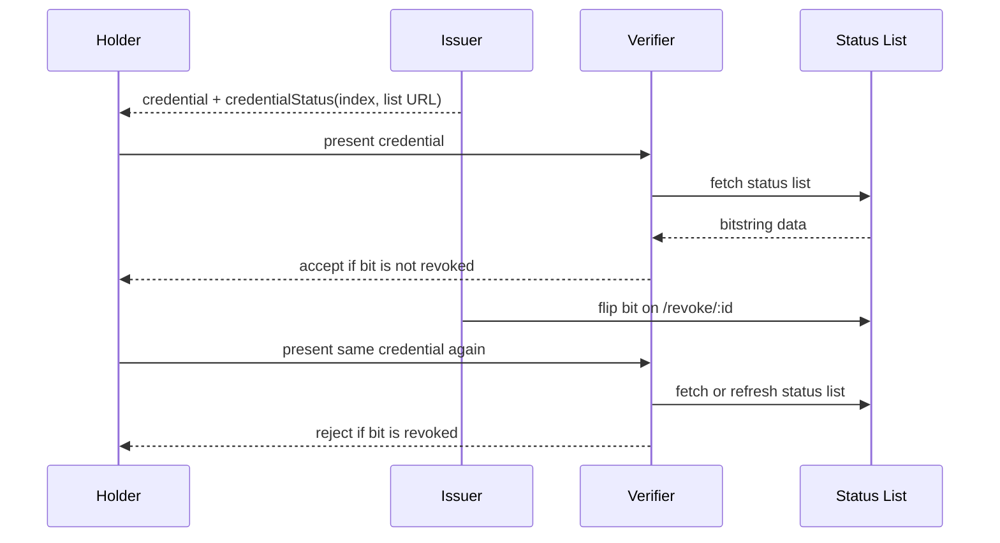

# Lab 05 — Privacy-Preserving Revocation (Bitstring Status List)

Branch: `lab-05-revocation` · Timebox: 20 minutes

Goal: embed credential status in issued VCs and have the verifier check a Bitstring Status List (via OHTTP if enabled).

## What This Lab Is Doing

This lab completes the lifecycle by adding revocation. A credential may still be well-formed and correctly signed, but it may no longer be acceptable. Students add a privacy-preserving status mechanism so the verifier can detect revocation without the issuer needing to answer a per-credential online query.

The model is:

1. issuer assigns each credential a status list index
2. issuer serves a bitstring status list document
3. verifier reads the relevant bit at verification time
4. revocation flips the bit instead of deleting or rewriting the credential

This is the final step that makes the credential system feel operational rather than purely academic.

## Flow Overview

## What Students Should Understand

- revocation is checked at verification time, not encoded only at issuance time
- the verifier needs both the credential and the current status list state
- a bitstring status list is more privacy-preserving than a direct “is credential X revoked?” lookup
- this lab builds on the issuance work from Labs 01 and 02 rather than replacing it

Prereqs
- Checkout branch: `git checkout lab-05-revocation`.
- Env ready: `pnpm env:setup`; set `STATUS_LIST_ID` as needed.
- Services running: `pnpm dev`.

Steps (edit + test)
1) Generate status list
   - From repo root: `pnpm --filter status-list run generate` (creates `status-list/data/1.json` by default).
2) Serve status list from issuer
   - In `issuer/src/index.ts`, ensure `/statuslist/:id.json` reads the generated file and returns JSON; guard mismatched IDs with 404.
   - In the issuance path (SD-JWT and BBS), include `credentialStatus` with `statusListIndex` (allocated per credential) and `statusListCredential` pointing to the issuer URL.
3) Verifier status check
   - In `verifier/src/index.ts`, fetch the status list (via OHTTP if `USE_OHTTP=true`), read the bit at `statusListIndex`, and fail verification if set.
   - Cache the list in memory to avoid repeated fetches; allow refresh on demand or TTL.
4) Revoke helper
   - Add `/revoke/:id` (or enable if stubbed) in `issuer/src/index.ts`, guarded by `ADMIN_TOKEN`. Flip the bit in the status list file/buffer and persist.
5) Run and test
   - Issue a credential (SD-JWT or BBS as in prior labs).
   - Verify: `curl -s -X POST http://localhost:3002/verify -H 'content-type: application/json' -d '{"format":"vc+sd-jwt","credential":"<sd_jwt~disclosures>"}' | jq` (or BBS payload).
   - Revoke: `curl -X POST http://localhost:3001/revoke/<credentialId> -H 'x-admin-token: <ADMIN_TOKEN>'`.
   - Verify again; expect failure due to status bit set.

Pass criteria
- Verifier succeeds before revocation and fails after the bit is flipped.
- Status list served at `/statuslist/:id.json` is readable and updates after revocation.

Troubleshooting
- Status list 404: ensure `STATUS_LIST_ID` matches between issuer, verifier, and generated file name.
- Bit not flipping: confirm the revoke helper writes back to `status-list/data/<id>.json` and updates the in-memory buffer.
- If verifier still passes post-revocation, clear cache or restart to refresh the list. 
